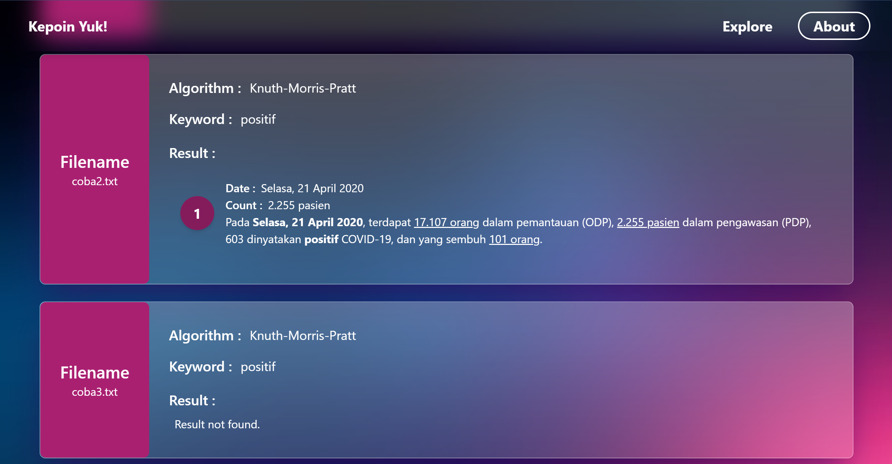

# Kepoin Yuk!
> Front-end side of a simple Information Extractor created using React, Tailwind CSS, and Flask

## General Information
Kepoin Yuk! is a simple information extractor to gather information faster based on the keyword given. The app receive the user folder input, filled with some txt file, to be proceed in order to get information about date and quantity/amount of things at a certain event. By using three popular string matching method (Knnuth-Morris-Pratt, Boyers-Moore, and Regular Expression), this app could summarize information better in a simple way for you! Furthermore, the project information is also provided for future improvements.

## Prerequisites
- node.js (v 18.12.1)
- npm (v 8.19.2)
- React (v 18.2.0)
- Tailwind (v 3.3.2)

## Available Scripts
In the project directory, you can run:

### `npm start`

Ths runs the app in the development mode.

The page will reload if you make edits. 
You will also see any lint errors in the console.

## Screenshots
Main page

Result

## Contributors
